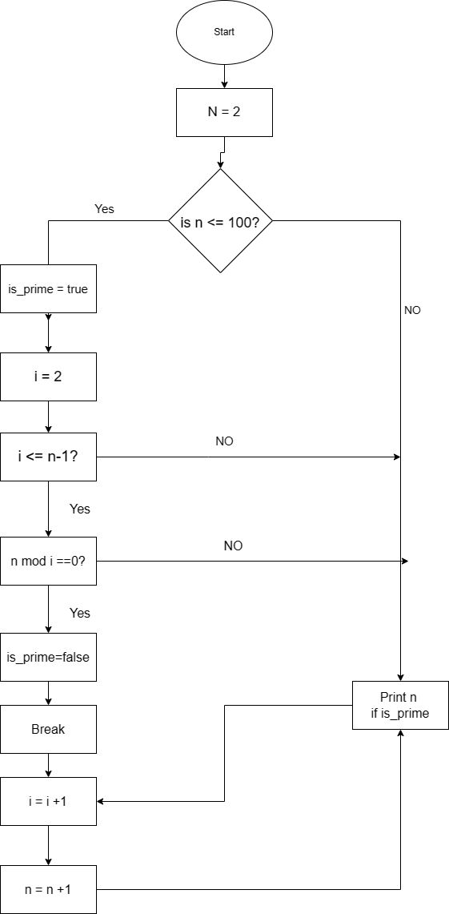

# Question 1: 

## Identify and explain common and important components and concepts of web development markup languages?

- Markup languages are used to create web pages, as well as define all their structures and contents. They use tags to format text, as well as data onto a web page. Tags are defined with special chatacters or words that determine when to apply formatting and have a opening and closing tag. Few examples of a markup language ares HTML(Hypertext Markup Language), XML(Extensilbe Markup Language), XHTML(Extensilbe Hypertext Markup Language) SGML(Standard Generalized Markup Language).

- One of the most common markup language for developer/designers for creating web pages, is the Hypertext markup language(HTML) which allow to instruct the browers on to how to show to data on the pages. HTML define the structures as well as contains meta-data and series of elements that are displayed on the web pages. it also used to defined tags such as <'table'>, <'form'> without the quations. 

- One important components of a markup language is it document model, it define how the data of the markup languages are structured and how they relate to each other.

- Another important component is a concrete syntax which will define on how the markup language is written.

- One last important component is a composable processing. which allow transferring a syntax into a general tree than the the final ouput.

https://en.wikipedia.org/wiki/Markup_language
https://matklad.github.io/2022/10/28/elements-of-a-great-markup-language.html
https://www.geeksforgeeks.org/explain-different-markup-languages-other-than-html/

# Question 2: 

## Define the features of the following technologies that are essential in terms of the development of the internet, explain how each technology has contributed to the development of the internet:

 - packets
 - IP addresses (IPv4 and IPv6)
 - routers and routing
 - domains and DNS

## Packets:

- Packets are informations in a network communications which consist of control information and user data, everytime you request a web page it send a packet to the server and then the server sends a packet back to you, continues until process is completed and then your computer reassembles all the packets into a single page. Data can be transferred effciently and possible for multiple computers to have a single connection. Packets have helped develop the internet because of packet-switching they can travel from multiple computers from the same wires in any order. IP(Internet Protocol) is used to to transfer over the internet IP packets are blocks of all data being transmitted over the internet it contains a Header and Payload, header has informations used to send through the internet. Payload is the data being transferred.

https://www.keycdn.com/support/network-packets

## IPv4: Internet Protocol Version 4

- Network part designates individual varietys that is specified to the network. IPv4 Host Part, identifies your computer with your network, it is also assigned to every host. Unllike the network part that is the same the host half must vary. The Subnet number is a nonobligatory part of an IPv4. Since the Local network has an enormous amount of host the host get divided into subnets and subnet numbers get appointed to that. IPv4 consist of four numbers eg: 15.64.300.100, They have a 32-bit integers, which are shown by decimal points. IPv4 have twelve header fields and the length of the header field is twenty. IPv4 also has different style of address like: Unicast, Broadcast and multicast. is also supports Virtual Length Subnet Mask(VLSM). It has help develop the internet due to sets of rule to allow devices like computer, tablets, phones. Every device that is linked to the internet has it own unique number assigned to them call an IP addresses.

https://www.geeksforgeeks.org/what-is-ipv4/

## IPv6: Internet Protocol Version 6

- IPv6 have a larger address space which means every square meter of our planet can have around 1564 addresses, it also uses four time the amount of bits to address devices on the internet. Simplified headers which is designed to be less complex and easier to process. IPv6 has an end to end connectivity so every machine has it own IP address and can travel through the internet without NATs or any Translating elements. Auto-configuration enurase that the link is right and determines if all the information the page needs to be auto-configured. IPv6 also has an option for IPSec(Internet protocol security), it is used at the networking processing layer to make sure the site is secure. It uses a multicast address to communicate so does not have any broadcast address. The newest version of IP uses 128-bit address eg: 3001:0da8:75a3:0000:0000:8a2e:0370:7334. IPv6 has helps develop the internet by exceeding the IPv4 due to the amunse of global internet users. 

https://www.spiceworks.com/tech/networking/articles/what-is-ipv6/
https://www.geeksforgeeks.org/what-is-ipv6/

## Routers Features:

- Routers work on a 3rd layer (Network Layer) of the OSI model, it communicates with its adjacent devices with help from IP addresses and Subnets. there are differnt types of routers and they are: wired routers and wireless routers. Routers have a high-speed internet connectivity with ports like: Gigabit, Fast-ethernet, and stm link port. Routers allow users to configure a port as per their request in the network. Router parts are, central processing unit(CPU), flash memory, RAM, Non-Volatile Ram, Console, Network, and a interface card. Routers traffic large amount of networking systems byt considering the sub-network is as an intact. Unwatned interface is filtered out byt the router, also carry out the data encapsulation and decapsulation process. Will always run in master and slave mode, allow all users to be able to connect to serval LAN and WAN Networks. Various paths are made to forward the data. Routers have helps develop the internet by allowing easier connection by only sharing a single network amoungs all the users. They have helped by being able to make local networks of devices,

https://www.javatpoint.com/router#:~:text=Features%20of%20Router%201%20A%20router%20works%20on,per%20their%20requirements%20in%20the%20network.%20More%20items
https://www.cisco.com/c/en/us/solutions/small-business/resource-center/networking/how-does-a-router-work.html#:~:text=A%20router%20helps%20you%20connect%20multiple%20devices%20to,devices%20or%20allow%20employees%20to%20share%20software%20tools.

## Routing features:

- Routing has help the routing machine to find the safest and fastest path between the two designation. It select paths for the IP packet that travel from the user to the destination. Routing is a process of paths in any network.It has helped the IP specify the origin and designation of where it need to go to and sent from. 

## Domains and DNS

- Domain in example are like home address your mates dont remember your GSP(Global positioning system) coordinates when they want to visit, they just use your street address, which is the same as using a website.

- DNS other known as “Domain Name System” is the unique name of your website. It allow you to connect to a website by matching human-readable domain names with the id of the server where a website is stored.

## Domains features:

Domains are parts of a web address you would use to find your website or a page of the website. Itt got a string of text that is associated with the numerical IP address. Example of a domain: https://brandonpowell.netlify.app/pages/about.html. Different parts of a domain are:

1. "Protocol"(https://)
2. Domain name("brandonpowell.netfily.app")
3. Subdirectory("/pages/")
4. Path("/about.html.")

## Domains, how  has it help develop the internet:

- Domains have help the internet by simpilying how to naviagate through a website, and helped due to IP address can be difficult for people to remember but are great for computers. It allow you to have ownership of your website, as well have full control over what your domain name is and who administers.

## DNS features:

- DNS is a unique domain name that is human readable, The maximum length that a domain name can be is 63 characters. Domain name systems have a second-level domain(SLD) which is a unique indentifer for your website, which is the bit the comes before the .com or other extensions. There is also a top-level domain(TLD) which is the part that comes after the second-level domain(SLD). Domain name examples: 

    1. youtube.com
    2. github.com
    3. instagram.com
    4. tiktok.com

## DNS how it has helped develop the internet:

- Domain name systems have helped due to users can enter a domain name of a website and it gets sent to the IP address of a server, they are also made to be easier to remember name instead of numbers to access data on a network and the internet.

https://blog.hubspot.com/website/what-is-a-domain#parts-of-domain-name
https://www.internetsociety.org/resources/doc/2004/the-internet-domain-name-system-explained-for-non-experts-by-daniel-karrenberg/

# Question 3: 

## Define the features of the following technologies that are essential in terms of the development of the internet, Explain how each technology has contributed to the development of client and server communication over the internet:

 - TCP
 - HTTP and HTTPS
 - web browsers (requests, rendering and developer tools)

### TCP feature:

- TCP(transmission contorl protocol) has a segment numbering system so it keeps track of each segment by being transmitted or received by allocating numbers to each and every single one of them, a Byte number is allocted to the the data bytes that are to be sent, while the segments are allocated sequence numbers.

- Flow control in TCP means it limits the rate at which the user can transfer the data through to is to make sure it is a reliable delivery. Receivers hint at the on how much data can be recieved.

- Error control implements error controls for reliable data transfer, error control is cbyte-oriented. All segments are checked for any error detections, which include corrupted segment, lost segment management, out of order and duplicate segments.

- Congestion control takes in account the amount of level of congestion in the network. Also the data is determined by the amount of the data sent by the sender.

https://www.geeksforgeeks.org/what-is-transmission-control-protocol-tcp/

### TCP: How has it helped client and server communications:

- It has helped establish connections between two different types of computers as well as that ti work independently of the OS, It aslo supports many different kind of routing protocols,

https://www.techtarget.com/searchnetworking/definition/TCP-IP#:~:text=The%20advantages%20of%20using%20the%20TCP%2FIP%20model%20include,place%20unnecessary%20strain%20on%20a%20network%20or%20computer.

## HTTP and HTTPS

- Http other known as (Hypertext Transfer Protocol) is a layer of protocol for transmitting hypermedia documents such as HTML.

- HTTPS other known as (Hypertext Transfer Protocol Secure) is the extension of the HTTP.

## HTTP features:

- HTTP has several feature here are some:

    1. Connectionless which is when a client initiates an HTTP request and after the request client disconnct with the server.

    2. HTTP is media-independent

    3. HTTP is extensible/customizable, which is good cause you can add new methods or headers.

    4. Caching controls how the document is cached.

    5. Relaxing the origin constraint, prevent any snooping and privacy invasions. 

## HTTP: How has it helped client and server communications:

- HTTP follows a client-server communication where an HTTP client sends a request message to an HTTP server, and in return, a server responds to the message. It also provides standardized way of communications between clients and servers. Can access resources on servers without having to no exactly where the come from. Has made it possible for servers to provide dynamic content that can be customized for each client.

https://www.w3schools.in/http/intro
https://medium.com/globant/essential-guide-to-http-b7d6f7023b7f
https://www.javatpoint.com/http

## HTTPS features:

1. HTTP/2
2. AMP(accelerated Mobile Pages)
3. Bluetooth(web bluetooth)
4. Brotli
5. getUserMedia(Webcam and Mircophone)
6. Geolocations
7. EME(Encrrypted Media Extensions)
8. Notifications
9. Payment Request API(Web Payments)
10. Service workers
11. Web Crypto

https://www.digicert.com/blog/https-only-features-in-browsers

## HTTPS: How has it helped client and server communications:

- HTTPS uses encryption for secure communication over a computer network. HTTPS provides a secure connection between a client and a server by encrypting all communication between them.

## Web browsers (requests, rendering and developer tools):

## Requests:

A web request is when a client request webs on the web, They are sent by using HTTP, it is a standard protocol for transferring data through the world wide web. When the user searches a URL or clicks on a hyperlink, the browser will send a web request to the website severs. Severs respond with sending the requested files or resources back to the user. Some types of web requests are: "GET" is one of the most common request made, it is made on behalf of the client when seeking data from a specific locations. Once has been requested the server will then process and send all the data and information back to user. "POST" is another common type of request through the web, the purpose of POST is to create or update subordinate resources, The POST request does not hold any additional data, but must be updated and refreshed or resubmitted. "PUT" this is a method that allow to target URL to be replaced with a new resource. It should be used to replace or overwrite resouces the users arent clearly aware of, "PATCH" is to modify a specfic resourse part, it is similar to "PUT" but it aims to only update or modify. "DELETE" is a method that send request to the server to delete any resources. "DELETE",It is not a preferred choice.

https://sourcedefense.com/glossary/web-request/

## Rendering

Web browsers use all different type of rendering engines to display a page the five main destops browsers have four different rendering engines like: Safari on OS x and IOS and native Andriod browsers use "Webkit", Chrome, Opera, Amazon Silk and Androids WebView(browsers that open within an app) us blink which is a open source engine based on webkit, Firefox uses Gecko which was developed by Mozilla Foundations and then Trident which is a engine developed by Mircosoft and used in internet explorer, microsoft edge browser will use a the newer version called EdgeHTML.

https://www.makeuseof.com/tag/how-do-browsers-display-web-pages-and-why-dont-they-ever-look-the-same/

## Developer tool features:

- Inspecting HTML and CSS codes.
- Debugging JavaScript
- Network Analysis
- Performance anaylsis
- Memory analysis
- Security analysis
- Accessibility analysis

https://www.geeksforgeeks.org/browser-developer-tools/
https://developer.mozilla.org/en-US/docs/Learn/Common_questions/Tools_and_setup/What_are_browser_developer_tools

## Developer tool how has it helped client and server communications:

- Developer tools helps developers create, debug, and optimize there code. They can also be used for client/server communication with other tasks like testing and debugging. For example, a developer tool like Postman can be used to test APIs and ensure that client/server communication is working properly, can also be used to monitor client-server communication and identifys any issue that arise with it. Goolge Chrome has a DevTool has a set of web developer tools already built into its browser that will help debug your client-side JavaScript code.

https://www.tutorialspoint.com/operating-systems-client-server-communication
https://www.geeksforgeeks.org/client-server-model/

# Question 4: 

## Identify THREE data structures used in the Python programming language and explain the reasons for using each.

## Lists:

- Lists are one of the essential data structures of Python to make a project. Lists are defined as an ordered collection of items. They are used to store multiple items into a single varible and update or delete Lists items. Insert multiple list items and dynamically increase it's size internally. Items in the list remain in order in which you added them, will not change order internally. 

https://www.w3schools.com/python/python_lists.asp
https://thispointer.com/what-is-a-list-in-python-and-why-we-need-it/

## Tuples:

- Tuples ares a collection of python lists but tuples are immutable. Tuples cannot be added or removed once created. We use tuples or immutable objects to allow substantial optimization. Sometime you dont want to change any data, if the collection is meant to be the same for the life of the program, using tuples over a list guards it against any accidental modifications.

https://stackoverflow.com/questions/2174124/why-do-we-need-tuples-in-python-or-any-immutable-data-type
https://realpython.com/python-lists-tuples/#defining-and-using-tuples

## Dictionary

- Dictionary keeps elements in a key-value mapping format and uses hashing for it. Dictionarys are the similar to Tuples, Lists. and Sets they allow  us to store numerous of data into a single varible. Using dictionary instead of varibles we save alot of time with coding which results in less typying and a much easier code to read. We can also easily retrieve a value from a dictionary by its unqiue key.

https://edstem.org/au/courses/11264/lessons/32537/slides/228595
https://thispointer.com/what-is-a-dictionary-in-python-and-why-do-we-need-it/
https://btechgeeks.com/what-is-a-dictionary-in-python-and-why-do-we-need-it/#Use_of_Dictionary

# Question 5: 

## Describe the features of interpreters and compilers and how they are different.

## Complier:

- Compliers will scan the whole program in one go, when it is scanning the code in one go the error if there is any will be shown at the end all together. Complier have a faster execution time, will convert source code into object code. Doesn't require source code for any later execution. Execution will only take place after the whole program is complied. Code will always be stored in a disk storage. Compliers take large amount of time analyzing the source codes. Change in source program after the compiltaion requires recompiling of an entire code. Object code is premanently saved for future uses.

## Interpreters:

- Unlike compliers, interpreters will only translate one statement at a time. Scans code one line at a time and shows every error line by line. Interpreters are must slowerd in executing the code. Requirs source code for later execution. Execution will only take place after every line is checked and evaluated. Code is nowhere to be stored. Interpreters take less time than Compliers for analyzing the source code. Change in source program during translation does not require retranslation of an entire code. No object code is saved for future uses. 

https://www.geeksforgeeks.org/difference-between-compiler-and-interpreter/

# Question 6: 

## Identify TWO commonly used programming languages and explain the benefits and drawbacks of each.

- Python has its own set of advantages and disadvantages.

## Python benefits:

- Python has abundance amount benefits to the developing software. One great benefit of pythons is it's highly extensible, meaning python extends to other programming languages and write C#, C, C++ and Java as well as other programming languages within  your pyhton code to add functionality. Great for desktop and server platforms

- Another great benefit of python is libraries. Library is a reusable code that can be used for common functions, e.g manipulating images, performing equations, database administration and regular expressions. Helps reduce coding errors, programmers are more efficent and make lines of code smaller in size. Can call upon a library often with a single line of code to perform the tasks.

https://www.developer.com/languages/python/python-benefits/


## Python drawbacks:

- Python runtime is much more slower than other programming languages due to it execute many common programming behaviors at runtime. Python on the other hand of being good at desktop and server platforms it is rarely used for mobile development. Inefficient Memory Consumption due to pythons huge amount of memory which isnt good when developing an app with a prefernce foe memory optimization.

https://www.geeksforgeeks.org/disadvantages-of-python/

## JavaScripts benefits:

- When you execute in JavaScript it has a much faster speed due to being produced on the clients side. Easy to learn for anyone that has basic knowlegde of programming. JavaScript can be used in a wide range of applications. It's also browser compatible, support all modern day browsers will always produce the same results. Server load is reduce due to being produce on clients side. It also has a drag and drop functionalities, Popularity is high due to being used every where on the web. JavaScript is updated Annually.

## JavaScripts drawbacks:

- Code is always visible to every one, JavaScript will stop rendering if there is one error in a the code. JavaScript doesn't inherite multiple inheritance only supports sing inheritance. Security Because JavaScript executes on the client side so it can be used to exploit applications. JavaScript sometimes interpretes differently by different browsers which results in few inconsistent UI.

https://www.w3schools.blog/advantages-disadvantages-javascript
https://www.w3schools.blog/what-are-the-disadvantages-of-javascript

# Question 7: 

## Identify TWO ethical issues from the areas below and discuss the extent to which an IT professional is ethically responsible in terms of the issue.

1. Access to a user’s personal information (medical, family, financial, personal attributes such as sexuality, relgion or belief)

- Users personal information rasies a few ethical issues such as privacy and confidentiality, Privacy is the rights to an individual to have all personal information private and not having to share with others without consent. Confidentiality is the obligation of aan individual or organization to keep personal information to themself and secure. 

- Medical informations has additional ethical issues such as informed consent and discriminations, informed consent is the right to an individual to be told about the personal information that is being collected and how they will use it. Discrimination is the unfair treatment of the individual based on there personal attributes like race, gender, sexuality, etc.

- Family and Financial informations ethical issue are the same and they are confidentially or a conflict of interest. A conflict of interest is when a individual or organization has different interest that can interfere with ability to act in the best interest for the indivual or organizations.

- IT professionals have ethical responsibilitys to protect the confidentially of personal inforamations that they access and collect. The ACM Code of Ethics and Professional Conduct states that IT professionals should respect other personal infromationas, as well as should respect privacy and should only access or disclose private information when there is a compelling professional reason.

https://www.ala.org/advocacy/intfreedom/librarybill/interpretations/privacy

https://www.oaic.gov.au/privacy/your-privacy-rights/your-personal-information/use-and-disclosure-of-personal-information

https://techspirited.com/ethical-issues-of-internet-privacy

2. Intellectual property, copyright, and acknowledgement.

- Intellectual property or (IP) is the creations of the mind like inventions, literacy, artistic work, designs, symbols, names and images.

- Copyright gives the copyright owner rights to control certain activities of there works, for examples these act are copying someone elses work, re-using someones work such as publication, performance, adaptation and communication of someones work in public or making it available online.

- A few ethical issue that can arise with, intellectual property, copyright and acknowledgement is Plagiarism, piracy and infringments. Plagiarism is when someone is presenting someone else's work as their own, piracy is unauthorized use or production of another persons work, infringments occur when a person take the action that implicates ethical issues from the copyright laws.

- IT professionals have a great responsibility to respect intellectual property rights and to make sure that there work doesn't infringe on other intellectual property rights. they also have to respect copyright laws, they have to be aware of any relevant legislations and policys, and should always follow codes of ethics. IT professionals also have responsibilities that they must adhere to when it comes to acknowledging, they should be able to make judgments and perofrm their work in the development of such a systems from a view.

https://copyrightalliance.org/differences-copyright-infringement-plagiarism/
https://business.gov.au/planning/protect-your-brand-idea-or-creation/intellectual-property
https://www.aiip.org/About/Professional-Standards
https://guides.library.iit.edu/c.php?g=474695&p=3248753
https://www.tandfonline.com/doi/full/10.1080/24750158.2019.1608496
https://www.michaelrauch.net/2011/07/ethical-responsibilities-of-the-computing-professional/
https://www.computerworld.com/article/2557944/ethical-issues-for-it-security-professionals.html

## For each ethical issue identify a source of legal information relating to the ethical issue and discuss whether the law is helpful in assisting a developer to act in an ethical way.

- Legal information evolving around this issue Access to a user’s personal information is the (OAIC),Office of the Australian Information Commissioner. It provides information about Australian Privacy law as well as including the use and disclosure of personal information, The privacy act 1988 regulates the way the individual's personal information is handled. This includes of use, disclosure and storage of personal information in any federal public sectors or private sectors. The principles cover: how personal information's collected, storage and security of anyone personal information, accuracy and completeness of personal information, and the general right of an individuals to be able to access and correct their own records. The Office of Australian personal information has developed a guide to help mobile device application developer they have embed better privacy practices through products and services and has well as help developers operating Australian market. 

- Copyright act 1968 is an australian law that relates to copyright, it is used to set out the nature, duration and ownerships in orinignal art, literacy,dramatic and musical. This law does help developers since it is classed as literacywork under the act. Because of this act businesses need to be careful when engaging software developers and if they intend to own the Intellectual Property in the software code, they have a signed agreement 

https://www.legislation.gov.au/Details/C2019C00042
https://www.10duke.com/resources/glossary/software-copyright/
https://www.oaic.gov.au/privacy/privacy-guidance-for-organisations-and-government-agencies/more-guidance/mobile-privacy-a-better-practice-guide-for-mobile-app-developers
https://statisticaldataintegration.abs.gov.au/topics/legal-and-policy-considerations/privacy-act-1988/

## Conduct research into a case study of ONE of the ethical issues you have chosen discuss how an ethical IT professional should respond to the case study and how they might mitigate or prevent ethical breaches.

- Equifax was a massive data breach that happened in America and announced that they had a cybersecurity data breach on September 7/2017 where approximately 44% of the population was affected. This breach happened because of Equifax's websites being vulnerable, Hacker obtain more than 143 million consumers personal information like, names, birth dates, addresses, drivers license numbers, social security numbers and as well as credit card numbers and dispute documents. Officials of Equifax became aware of the hack on July 29/2017, few months before they let consumer know. The vulnerability of the Equifax breach was because of the Apache struts CVE-2017-5638 which is a framework for creating Java web applications and is maintained by the Apache Struts. Equifax has had other hacking due to the flaws of the companys security. March 2017 Equifax had a seperate data, which had the company notified a small number of banking customers and had a security firm to assit into the data breach. In september 2017, consumer finanical protection bureau opened there investigation into the data breach, in december 2016 before the breach a security researcher examined equifax servers and told the company that there servers were vulnerable to a data breach that occured in 2017, They only got it patched after the mid-2017 breach had taken place. Equifax ended up have an independent cybersecurity team investigate after the mid-2017 breach which more security flaws were found. After equifax found the breach in july 29 two weeks after that the company 225 cybersecurity team could report the firm has been hacked to the CEO. After the breach was announced on spetember 2017, reporters had discovered that four senior executives sold shares of the comany worth nearly $1.8 million in July 29 after the breach was discovered. Equifax also conducted its own investigation when they sold the stocks and concluded that none of the four executives knew about the breach when they sold stock. The cheif information officer Jun Ying, sold nearly $1 million of stock days before the the data breach was announced on September 7. A day after, Equifax had their sahres drop 14 percent. Ying Could've avoided more than $117,00 in losses if he wouldve waited after the disclosure. After the announcement on September 7, Equifax directed all cunsumers to a website that can help them ceck if their data has been compromised. They also had to check a box that had agreements of Equifax's terms and conditions. The term includes a hidden clause for when use of the site waived a user's rights to a class-actions lawsuit.

- The way an IT professional could mitigate or prevent this sort of breach from happening, they could use some more better practices and tactics like: require all users to reset passwords every now and then to reduce the risk of credential compromises, they could also increase password lengths and complexitys requirements to mitigate brute force attacks. Make a lockout if you failed multiple login attempts. discourage users to not repeat the same password over different services like banking, social media, and discourage sharing of password. They could also use advanced network monitoring and threat dectection tools, train on security awareness and best pracrices for handling informations. Test security measures regularly to identify vulnerabilitys.

https://ethicsunwrapped.utexas.edu/video/equifaxs-breach-of-trust
https://archive.epic.org/privacy/data-breach/equifax/
https://www.oaic.gov.au/privacy/privacy-guidance-for-organisations-and-government-agencies/preventing-preparing-for-and-responding-to-data-breaches/preventing-data-breaches-advice-from-the-australian-cyber-security-centre
https://www.upguard.com/blog/prevent-data-breaches

# Question 8: 

## Explain control flow, using examples from the Python programming language

- Control flow is how the user contructs the program. It control the way individual statements, intructions and function calls are excecuted. A control flow statement results in a choice of whats two or more paths to follow.  there are a few control flows like sequential control flow, booleans, comparison operators, the most fundamental ways to control the flow of and execution is with if, elif and else control flow statements. Condition statements execute a block of code if a certain condition is true. Loops are execute a block of code repeatedly if the certain statement is true. Functions call execute a block of code that has been defined elsewhere.

https://edstem.org/au/courses/11264/lessons/32534/slides/228577
https://en.wikipedia.org/wiki/Control_flow

Examples of some different Control flows:

## Booleans reviews:

- Booleans are a type of data that can either have two vaules True or False. which is to represent if the value of the expression is true or false. Compare two different vaules the expression in python will return the boolean reviews true. 

Here is and example of a Boolean review:
```
    x = 5
    y = 10
    print(x < y) # Output: True
```
In this example above, we have two vaule (x,y), with the less < sign. Which when your in Python it will come back true because x is less then y. 

https://www.w3schools.com/python/python_booleans.asp

## "if" statement:

- IF statemants will alwayscheck a value of a boolean statement to determine if it is going to be true or false, if it is true the code below the indented code will be executed. An if statement is a conditional statement used for decision-making operations in Python.

Here is an example of an "if" statement:
```
    flag = True
    if flag==True:
    print("Welcome")
    print("To")
    print("BeginnersBook.com")
```
In this example above the code that uses an if statement to check whether the variable "flag" is True or not. If it is True, it will print “Welcome”, “To”, and “BeginnersBook.com” on separate lines

https://www.w3schools.com/python/gloss_python_if_statement.asp

https://edstem.org/au/courses/11264/lessons/32534/slides/228577

## "elif" "else" statement:

- The elif statement in pythons is short for else if, it checks multiple conditions and executes a block of code as soon as the of the codes evaluates to true. You are aloud multiple "elif" statements in your code for additional conditions.

Here is an examples of elif and else statement.
```
    x = 10
    if x > 10:
    print("x is greater than 10")
    elif x < 10:
    print("x is less than 10")
    else:
    print("x is equal to 10")
```
In this example above the code first checks if x is greater than 10, if not it will move to the next code and check if x is less than 10, if that is not true it will than execute the else block.

https://pythonexamples.org/python-elif-example/

## "pass" statement:

- The "pass" statement in python is a null statement and can be used as a placeholder for future code, you usd "pass" statement when a statement is required syntactically but dont want any code executed.

Here is an example of a pass statement:
```
def empty_function():
    pass
```
In this example above empty_function(): will do nothing due to only having a pass statement 

## Ternary Operator

- Ternary Operators is a shorter way of writing if-else statements in python. It will take three operands and also evaluate a "Boolean" expression. If your expresson becomes "true" the first operand will return. Otherwise it returns the second operand.

Here is and example of a Ternary operator:
```
x = 10
y = 20
result = x if x > y else y
print(result)
```
In this example above you it will print out the vaule "y" beacuse "x" is not greater than "y" so the ternry operator will reuten the vaule "y" as the result.

https://www.dataquest.io/blog/python-ternary-operator/

https://pythongeeks.org/python-ternary-operators/

https://www.geeksforgeeks.org/ternary-operator-in-python/

# Question 9: 

## Explain the difference between type coercion and type conversion. Are either of these used in Python?

- Type Coercion and Type Conversion are methods of converting data into python. 

1. Type coercion has an implicit process that is automatically converted into one data type to other data types without programmer intervention. Example: add integer and float together in python it will automatically convert the integer to a float.

2. Type conversion is a explicit process that requires a programmer to interven with it. Example if you convert a string to an integer you would have to use int() function.

https://vegibit.com/type-coercion-vs-type-casting-in-python/
https://medium.com/analytics-vidhya/python-fundamentals-for-everybody-type-conversion-vs-type-coercion-34234e99c9c4


# Question 10: 

## Explain data types, using examples: 

- Python data types are data items made up of classification or categorizations. Each one represents the kind of value that will tell you what operation can be executed on a particular data. Data types, classes and variables are objects of python.

https://careerfoundry.com/en/blog/data-analytics/python-data-types/#what-is-a-python-data-type
https://www.geeksforgeeks.org/python-data-types/

## Numeric data types:

- Integer are a set of numbers comprising zero, as will as posivite and negative numbers. It can also be written without fractional components. Integers cannot be any kind of fractions, decimal or a pre-cent. Some examples on an integers numbers are, 1,3,4,8,-43,-556.

Example 1:
```
    print(10 + 10)
    output = 10
```
In this example above we have an addition sum used by the + so (5 + 5) will output to 10.

Examples 2:
```
    print(50 - 30)
    output = 20
```
In this example above we have an subtraction sum used by the -, so in python it will output to 20.

Example 3:
```
    print(10 * 30)
    output = 300
```
In this example above we have an multiplication sum used by the *, so the output will be 300.

- Floats is an numerical data type that represents a floating-point number, floating-point number is a decimal point or an exponent notation, which indicates that a number is a certain number before and after the decimal point or exponent. The float() function converts an integer or a string to a floating-number.

Example of a float:
```
    x = float("45.32")

    print(x)
```
In this example above we have a decimal point number with float at the start of it, the float value allow it to be converted into a floating-point number and the output will be   "45.32".

https://www.w3schools.com/python/ref_func_float.asp

- Complex fuction is a built in fucton in python that get used for any complex numbers or to convert integers or string into a complex number, complex numbers have two parts to it, real and imaginary parts, they are numbers represented such as like a+bj or a+bi, A is the real part/number and B is an imaginary number/part. you can access real and imaginary parts by using the fuction "real()" and "imag()".

```
    x = 3+5j

    y = 5j

    z = -5j

    print(complex(x))

    print(complex(y))
    
    print(complex(z))
```    
In this example above we have three different number associted with with x,y and z they are     3+5j, fj and -5j.

https://www.w3schools.com/python/python_numbers.asp

## String data types:

- str() in python is a string of caracters. Strings are charcters enclosed in quotes (either single or double quations). Example "brandon" or 'brandon', you can also use a str() to convert other datas to strings.

Example of str():
```
    x = str("Hello World")
    print(x)
```
in this example above we have used x = str("hello world") and then have print(x), print will then print the words Hello World, str has converted an intger into a string. 

## Binary types:

- Bytes are represents byte size integers (from 0-256). The byte() function allows us to convert data to an immutable byte-represented data. Bytes syntax is bytes(x, encoding, error). Bytes contains data that are machine-readable.

Example of a byte() function:
```
    string = "Brandon Powell"
    bytes_string = bytes(string, 'utf-8')
    print(bytes_string)
```
In this example above we have used string = "Brandon Powell" then we have byte_string function with = byte(string, 'utf-8), then print(byte_string), the output of all this will come out to be b'Brandon Powell'

https://www.programiz.com/python-programming/methods/built-in/bytes

https://www.geeksforgeeks.org/python-bytes-method/

- Bytearray is a mutable sequence of bytes that holds data in a machine-readable data. Data that is saved in a secondary storage which is encoded according to a caertain type of encoding like ASCll, UTF-8 and UTF-16 for strings, for images they encode with either PNG, JPG and JPEG as well as mp3, You can create a byte array by using the bytearray() function and bytearrays have the most usual methods of mutable sequences. A byte array is a collection of bytes, which are integers that range from 0 to 255.

Here is an examples of a bytearray:
```
    byte_array = bytearray([4, 5, 6])
    print(byte_array)
```
In this example above we have used byte_array = bytearrray([4, 5, 6]), and then we have print(byte_array), this out put will put it into a bytearray output and that is: bytearray('b\x04\x05\x06').

https://www.programiz.com/python-programming/methods/built-in/bytearray

https://www.pythonforbeginners.com/data-types/bytearray-in-python

- Memoryview is a bulit in function for python to allow access, to internet data of the object that helps support the buffer protocol wihtout copying it. Memory-view will return the given arguments.

Here is an example of a memoryview:

```
x = memoryview(b"Brandon")

print(x)

#return the Unicode of the first character
print(x[0])

#return the Unicode of the second character
print(x[1])

#return the Unicode of the third character
print(x[3])
```
- In this example above we have created a memoryview object from a byte object "Brandon" with the varible it is assigned to x, then we have print(x) which outputs this outcome: <memory at 0x14a00eac8a00>, then we have three different other prints that will return is uni code value of the character it is assigned to with the index operator[], the first unicode print(x[0]) return the value at 66 then second unicode print(x[1]) return the value 114, and lastly we have the third one print(x[3]), which will return the value 110.

https://www.w3schools.com/python/ref_func_memoryview.asp 

https://www.programiz.com/python-programming/methods/built-in/memoryview

# Question 11: 

## Here’s the problem: “There is a restaurant serving a variety of food. The customers want to be able to buy food of their choice. All the staff just quit, how can you build an app to replace them?”

-  Identify the classes you would use to solve the problem

Classes you would use would be:

- Menu class
- Order class
- Customer class
- Table class

Write a short explanation of why you would use the classes you have identified

- I would use a menu class to showcase all the food and drinks that are available in restaurant.

- Order class would be used so it can show what the customer has ordered and will show the total cost of the order.

- Customer class would be used for to show information about customers name, contact details and order history.

- Table class would be use to represent a table in restuarant, it will contain the tables number and capacity of the table.

# Question 12: 

## Identify and explain the error in the code snippet below that is preventing correct execution of the program

Code snippet:
```
    celsius = input()

    fahrenheit = (celsius*9/5)+32

    print(f"The result is: {fahrenheit}.")
```
Solution:
```
    celsius = float(input())

    fahrenheit = (celsius*9/5)+32

    print(f"The result is: {fahrenheit}.")
```
The error of the code snippet is because it was trying to multiply the string with the numbers which isn't possible in python. To make it work we needed to had a float or even a integer infront of the input. 

# Question 13: 

## The code snippet below looks for the first two elements that are out of order and swaps them; however, it is not producing the correct results. Rewrite the code so that it works correctly.

Code snippet:
```
    numbers = [5, 22, 29, 19, 51,78, 96, 84]
    i=0
    while (i < len(numbers) - 1) and (numbers[i] < numbers[i+1]):
        i += 1
    print(i)
    numbers[i] = numbers[i+1]
    numbers[i+1] = numbers[i]
```
- I have ideniftifed that in line 2/i=0 hasnt been spaced evenly.

- The line that has number[i] = number[i+1] and number[i+1] = number[i] have not been put on one line and doesnt have a , instead of = for numbers[i] = numbers[i+1].

- I have also identified that after the numbers line there is not a print(numbers)

Here is the Solution for the code snippet below:
```
    numbers = [5, 22, 29, 19, 51,78, 96, 84]
    i = 0
    while (i < len(numbers) - 1) and (numbers[i] < numbers[i+1]):
        i += 1
    print(i)
    numbers[i], numbers[i+1] = numbers[i+1], numbers[i]
    print(numbers)
```
# Question 14: 

## Demonstrate your algorithmic thinking through completing the following two tasks, in order:

1. Create a flowchart to outline the steps for listing all prime numbers between 1 and 100 (inclusive). Your flowchart should make use of standard conventions for flowcharts to indicate processes, tasks, actions, or operations

Here is my flowchart below:



2. Write pseudocode for the process outlined in your flowchart

```
for n from 2 to 100
    is_prime = true
    for i from 2 to n-1
        if n mod i == 0
            is_prime = false
            break
    if is_prime
        print n
```

# Question 15: 

## Write pseudocode OR Python code for the following problem:

- You have access to two variables: raining (boolean) and temperature (integer). If it’s raining and the temperature is less than 15 degrees, print to the screen “It’s wet and cold”, if it is less than 15 but not raining print “It’s not raining but cold”. If it’s greater than or equal to 15 but not raining print “It’s warm but not raining”, and otherwise tell them “It’s warm and raining”.

Pseudocode code:
```
if raining is true and temperature is less than 15:

print "It's wet and cold"

elif raining is false and temperature is less than 15:

print "It's not raining but cold"

elif raining is false and temperature is greater than or equal to 15:

print "It's warm but not raining"

else:

print "It's warm and raining
```
# Question 16:

### ACME Corporation are hiring a new junior developer, as part of their hiring criteria they've created a "coding skill score" based on the specific competencies they require for this role; the more important the skill is for ACME corp, the more points it contributes to the "coding skill score" The skills are weighted as follows:

- Python (1)
- Ruby (2)
- Bash (4)
- Git (8)
- HTML (16)
- TDD (32)
- CSS (64)
- JavaScript (128)

Write a program that allows a user to input their skills and then tells them 

1. Their overall "coding skill score" 
2. Skills they may want to learn, and how much each one would improve their score

```
skills = {
    'Python': 3,
    'Java': 2,
    'C++': 2,
    'HTML': 1,
    'CSS': 1,
    'JavaScript': 2,
    'SQL': 2
}

def get_skill_score(user_skills):
    score = 0
    for skill in user_skills:
        score += skills.get(skill, 0)
    return score

def get_skill_suggestions(user_skills):
    suggestions = {}
    for skill, value in skills.items():
        if skill not in user_skills:
            suggestions[skill] = value
    return suggestions

user_skills = input('Enter your skills separated by commas: ').split(',')
user_skills = [skill.strip() for skill in user_skills]

score = get_skill_score(user_skills)
suggestions = get_skill_suggestions(user_skills)

print(f'Your coding skill score is: {score}')
print('Skills you may want to learn:')
for skill, value in suggestions.items():
    print(f'- {skill} (improves score by {value})')
```

- This example above will show you what your skill score is and what else you will be able to learn to to improve you skill score, The skills dictionary defines each skill toward the calculation of the score. The other function get_skill_score will calculate the users score by veiwing over the skills, get_skill_suggestions is a function that will return skills of the dictionary that the user may want to learn. The input is then split into the list of skills and any leading or trailing white spaces are removed because of the strip() function. 

- The first function returns a score based on the user’s skills while the second returns a dictionary of suggested skills to learn along with the value by which each skill would improve the user’s score. Then it will prints the users skill score and the suggested skill they might want to learn to improve there knowledge and score.